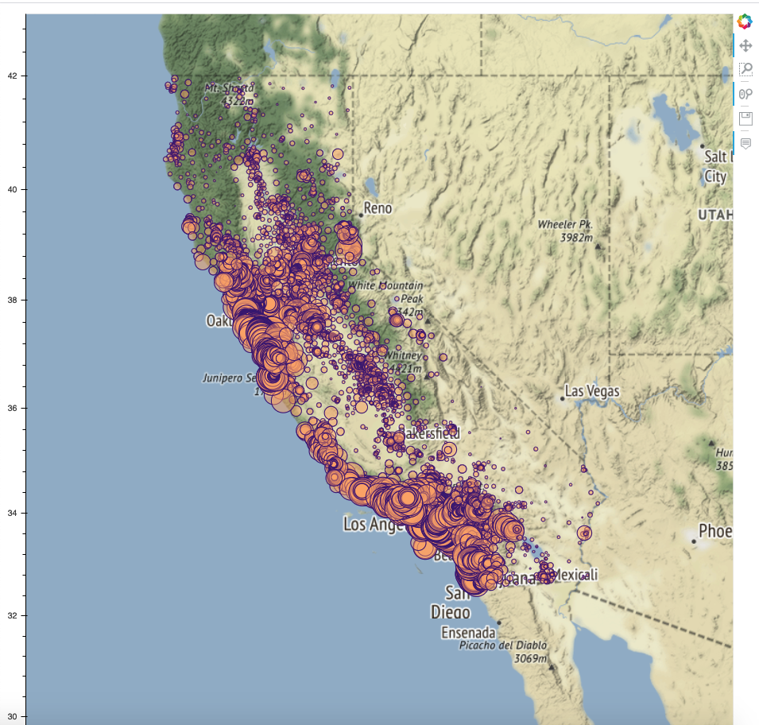
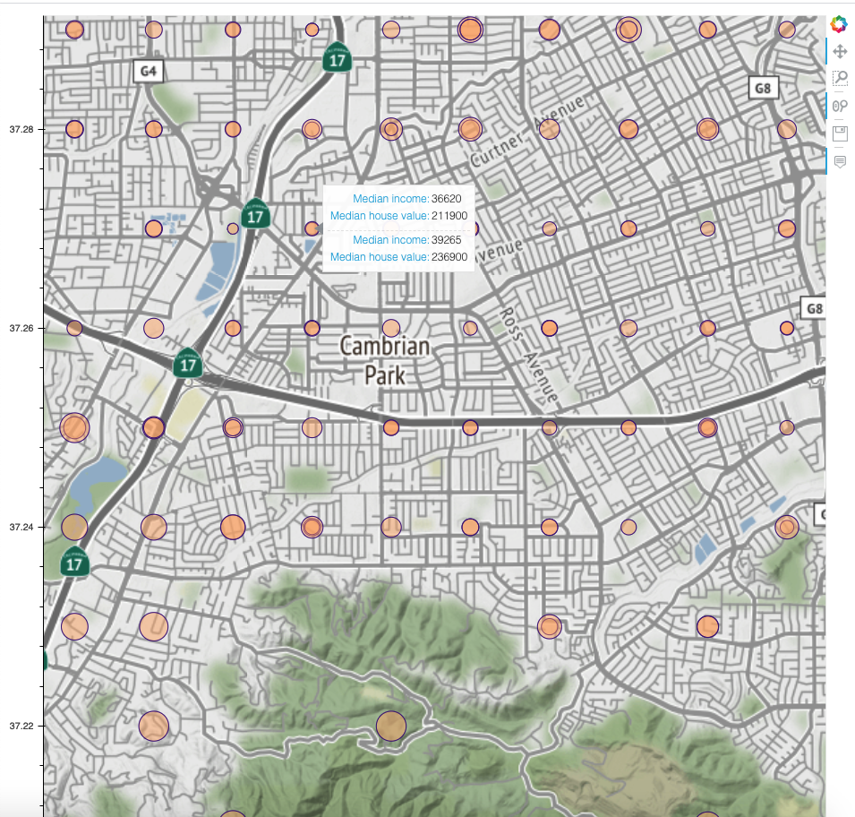

[](https://poser.pugx.org/ali-irawan/xtra/license.svg)
[](https://www.python.org/downloads/release/python-373/)


# Visualizing California housing dataset on Open Street Map API
 
 This is the very first dataset that any ML/AI entusiast works on. Most of them will do plotting using matplotlib which is really exciting, however, wouldn't it be better, if  somehow the datapoints could be plotted on a real map.

As I was reviewing ML concepts from (https://github.com/ageron/handson-ml2), a very wonderful resource, I thought I should give it a try . So , here is the outcome using `leaflet.js from Bokeh` with `python` .
 

 

And here is the zoomed in view, upto street level. Pretty cool!!

 

The circle size in those plots represents the median housing price; so bigger a circle, costlier the house. I also kept the ```median age and median housing price``` in the data tip, which can be modified.


## Table of contents
* [General info](#general-info)
* [Prerequisites](#technologies)
* [Setup](#setup)
* [Sample output](#sample-output)

## General info
This is a simple modular python code that uses open street maps to plot lat-long of California housing dataset. The circle size represents the median housing price. 
* Once you run the script `mainCaliCall.py`, the `loadData` class fethces the data from the `URL`, places it in a directory- `housing`, reads it using `pandas` and returns the dataframe by class method.
* After that,  module- `mercFxn`  is called that changes the lat-long to mercator cordinates. This module is in the class `dataProcessors`. The open maps accept only mercator coordinates, the details of these can be found on this Wikipedia page- (https://en.wikipedia.org/wiki/Universal_Transverse_Mercator_coordinate_system).
* Once those cordinates are found, `Plotting` class is initialized, that uses different modules of `bokeh` to plot them on an open street map. The map is choosen by the `bokeh.tile_providers`. In case you want to use `google maps`, you can call the google map API fron this  module.
* Finally, the output is rendered instantly on your ```default browser``` and a html file is saved in your directory as `CaliPlot.html`  that you can use it later. In addition, the plot be saved as `.svg` or `.png`. 
	
## Technologies
Project is created with:
* python: 3.x
* Holoviews-bokeh: install with ```python $conda install holoviews ```
* Pandas: install with ```$conda install pandas```
* six, tarfile
* Scipy 
* Numpy
	
## Setup
To run this project, download the repository to any folder. Open the folder and run the following main script from terminal/command line/ide:
```
$python3 mainCaliCall.py 
```

## Sample output

Here is an one instance of the map. Check all those big circles near the ocean side than the inland one.

 


